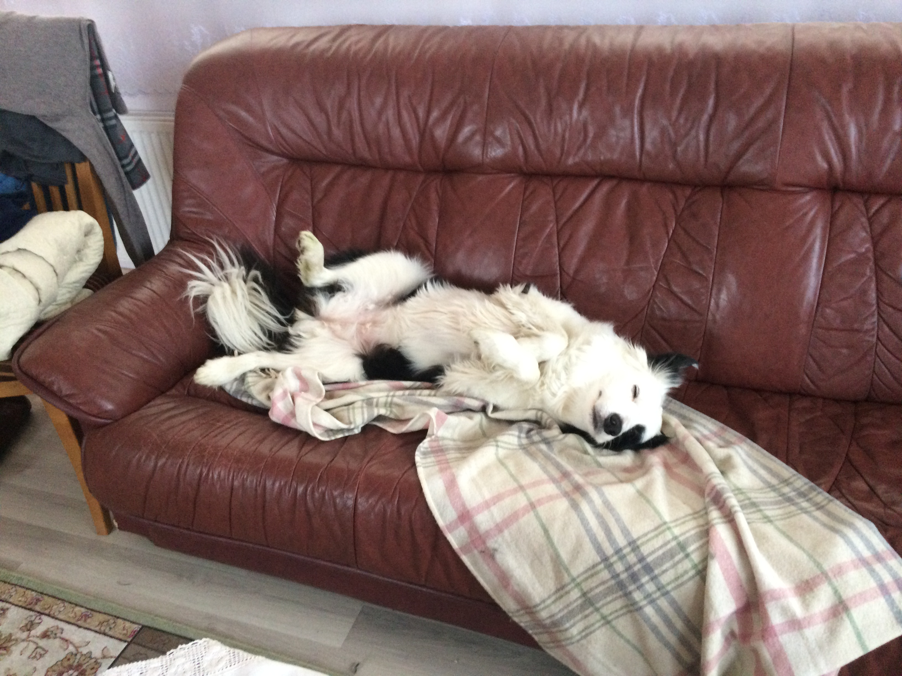

# Markdown

Failo pletinys: .md

Isamesne info:

https://docs.github.com/en/search?query=get+started

#Markdown
Rasome nauja tekstini faila

## Sarasas

-pomidoras

-agurkas

-bulve
## Bold ir Italic

Labas rytas, Lietuva!

**Labas** rytas, Lietuva!

Labas _rytas_, Lietuva!

_**Labas rytas, Lietuva!**_

## Nuorodos

Github [mano profils] https://github.com/ZMaknickas

## Nuotraukos

![alt text]

Kitos veisles- 

- **BOREDERIS;**
- **VOKIECIU AVIGANIS;**
*LABRADORAI;*